# OrchestrAIte: System Architecture and Data Flow

This document provides detailed visual representations of the OrchestrAIte system architecture, showing both the embedding process (how musical data is stored) and the generation flow (how music is created).

## Table of Contents
- [RAG Embedding Flow](#rag-embedding-flow)
- [Music Generation Flow](#music-generation-flow)
- [Agent Interaction Diagram](#agent-interaction-diagram)
- [Data Processing Pipeline](#data-processing-pipeline)

---

## RAG Embedding Flow

This diagram shows how MIDI files are processed and stored in the vector database for later retrieval during music generation.

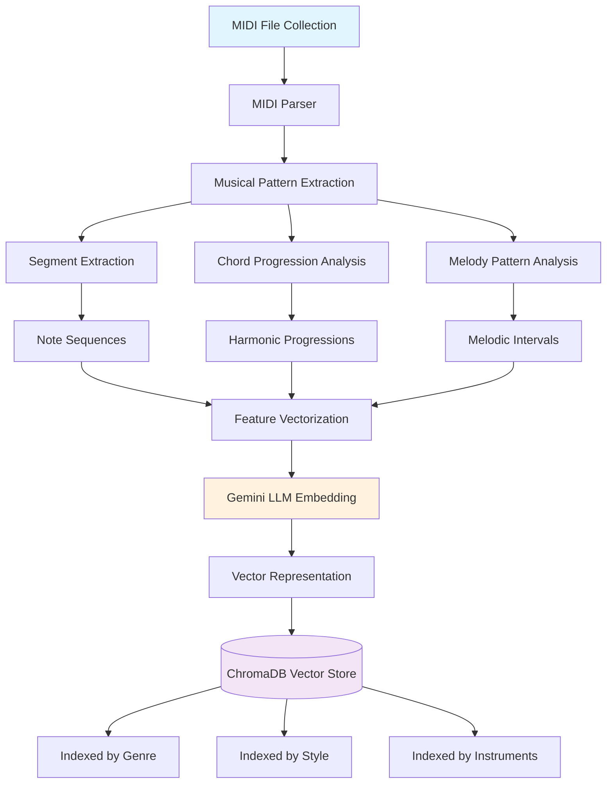

### Embedding Process Details

1. **MIDI Collection**: Raw MIDI files from various sources
2. **Pattern Extraction**: Musical segments, chord progressions, and melodic patterns
3. **Vectorization**: Convert musical features to numerical representations
4. **LLM Embedding**: Use Gemini to create semantic embeddings
5. **Storage**: Index and store in ChromaDB with metadata

---

## Music Generation Flow

This diagram illustrates the complete process from user input to final music output.

### Input Processing & RAG Retrieval
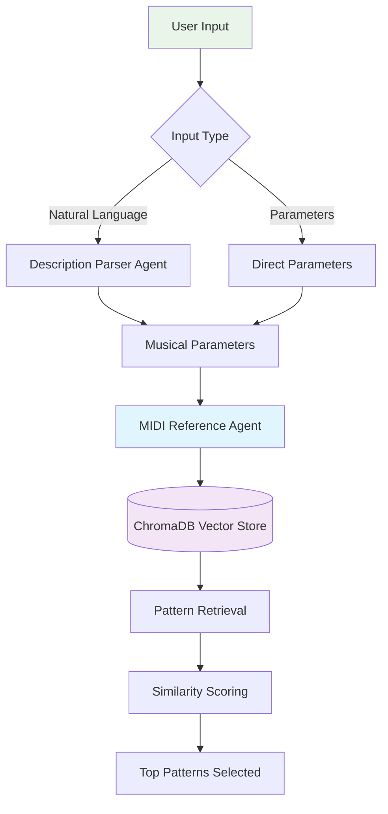

### Agent Orchestration & Generation
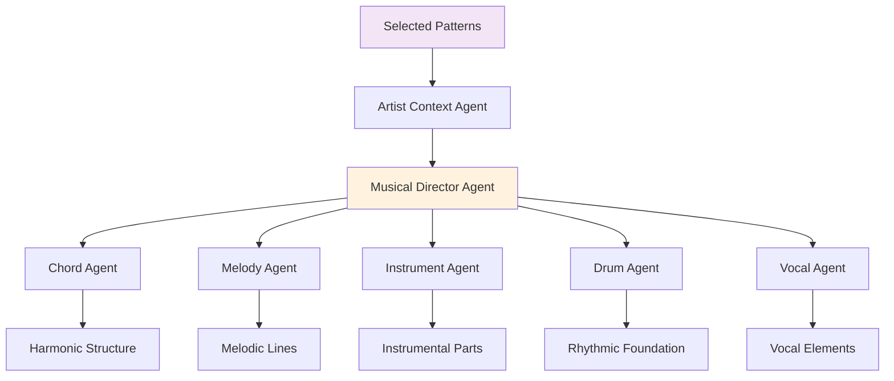

### Synthesis & Output Generation
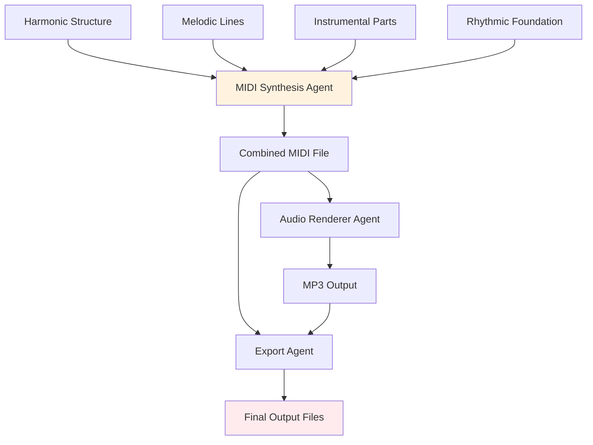

### Generation Process Steps

1. **Input Processing**: Parse user requirements into musical parameters
2. **RAG Retrieval**: Query vector database for similar musical patterns
3. **Context Application**: Apply artist-specific styling and characteristics
4. **Multi-Agent Generation**: Parallel creation of musical elements by specialized agents
5. **Synthesis**: Combine all elements into cohesive musical composition
6. **Output**: Generate final MIDI and MP3 files with quality validation

---

## Agent Interaction Diagram

This diagram shows how different agents interact and share information during the generation process.

### Core System Layers
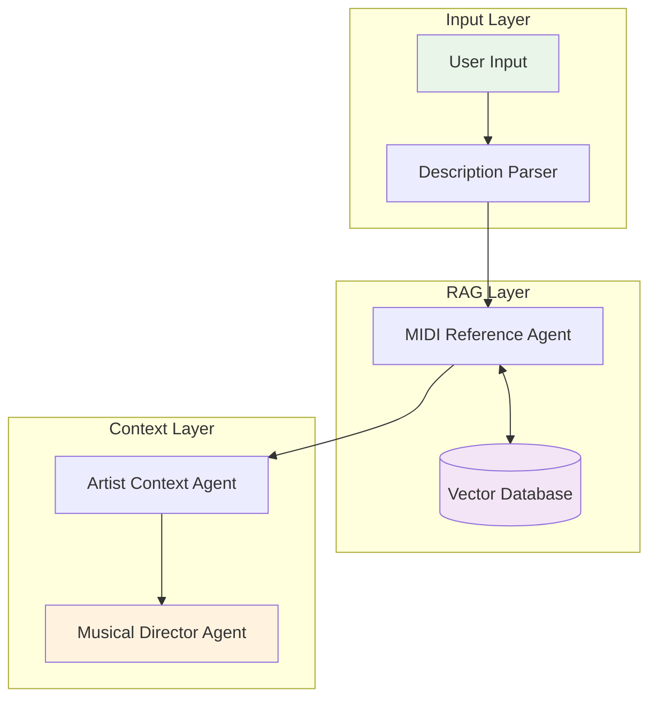

### Generation Agents Network
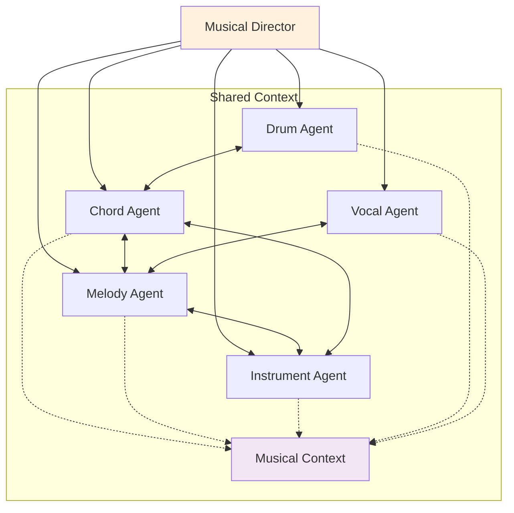

### Output Processing Chain
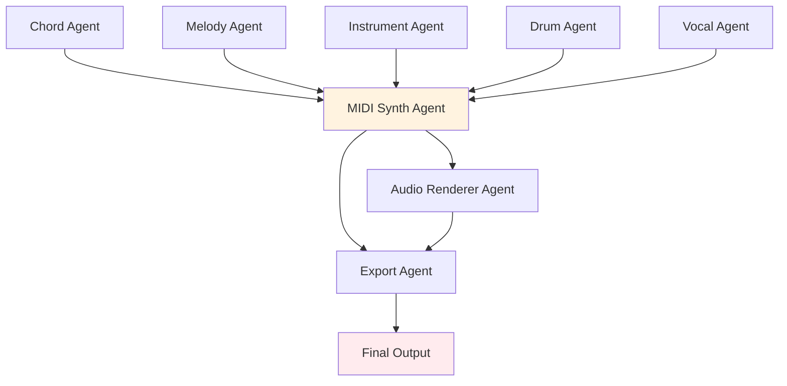

### Agent Communication Patterns

- **Solid arrows**: Direct data flow between components
- **Dotted arrows**: Shared context access for coordination
- **Bidirectional arrows**: Collaborative interaction and feedback loops
- **Subgraphs**: Logical grouping of related system components

---

## Data Processing Pipeline

This diagram shows the detailed data transformation pipeline from input to output.

### Input to RAG Processing
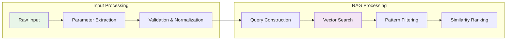

### Musical Intelligence & Generation
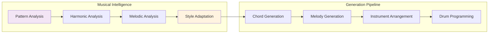

### Post-Processing & Output
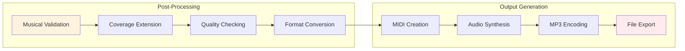

### Pipeline Stages

1. **Input Processing**: Clean and validate user input parameters
2. **RAG Processing**: Retrieve and rank similar musical patterns from vector database
3. **Musical Intelligence**: Analyze and adapt patterns for generation context
4. **Generation Pipeline**: Create musical elements using specialized AI agents
5. **Post-Processing**: Validate, extend, and optimize generated musical content
6. **Output Generation**: Convert to final MIDI and MP3 formats with quality assurance

---

## RAG Query and Response Flow

This diagram specifically focuses on how the RAG system processes queries and returns relevant musical patterns.

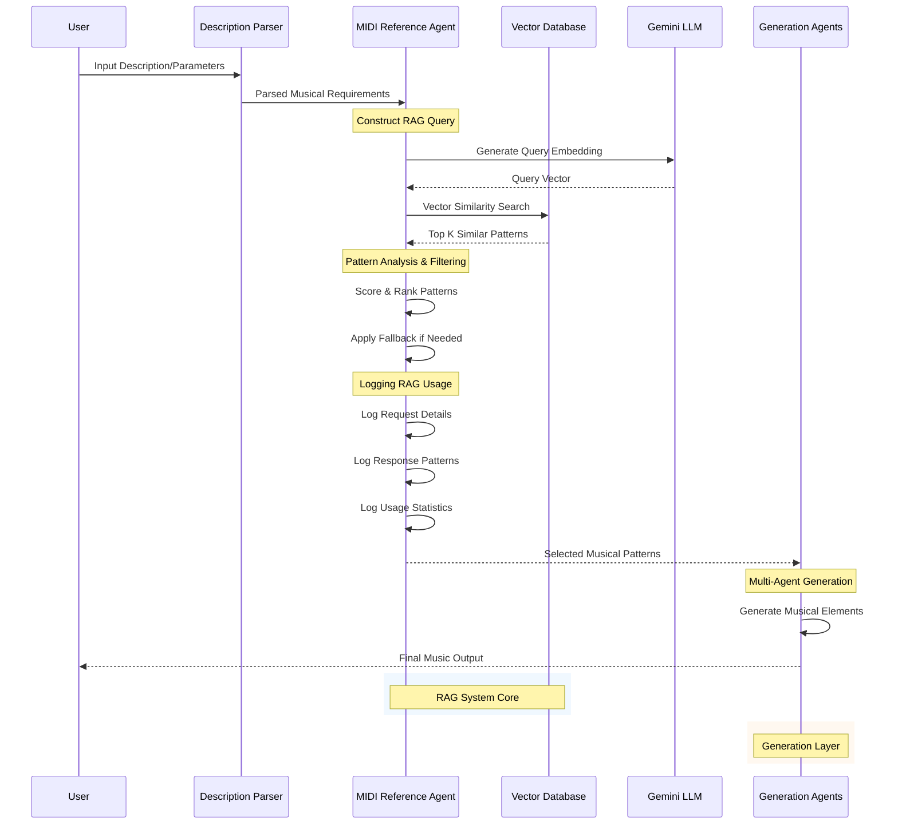

### RAG Process Details

1. **Query Construction**: Convert musical requirements to searchable vectors
2. **Similarity Search**: Find patterns matching the musical style/genre
3. **Pattern Selection**: Score and rank retrieved patterns
4. **Fallback Handling**: Use database fallbacks for robust operation
5. **Usage Logging**: Track RAG queries and responses for transparency
6. **Pattern Distribution**: Provide selected patterns to generation agents

---

## System Performance Metrics

### RAG System Performance Distribution
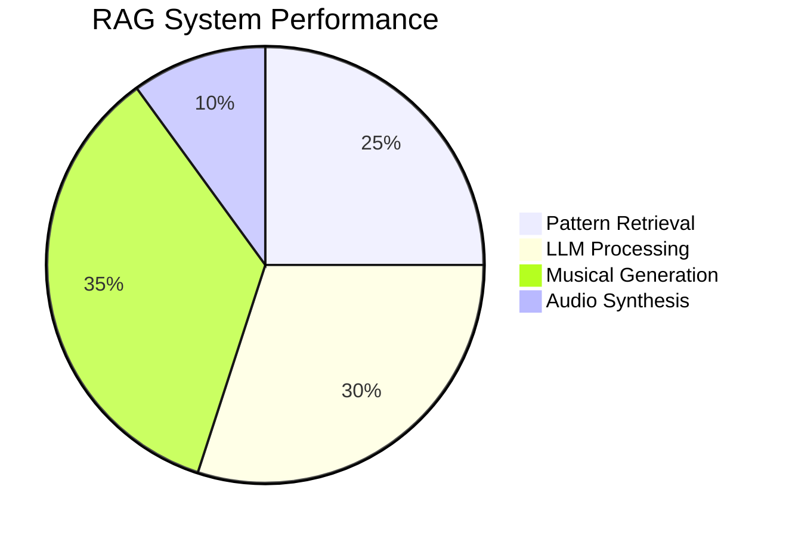

### Generation Agent Workload Distribution
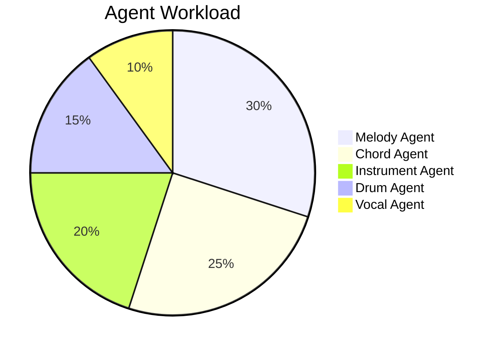

### System Resource Usage
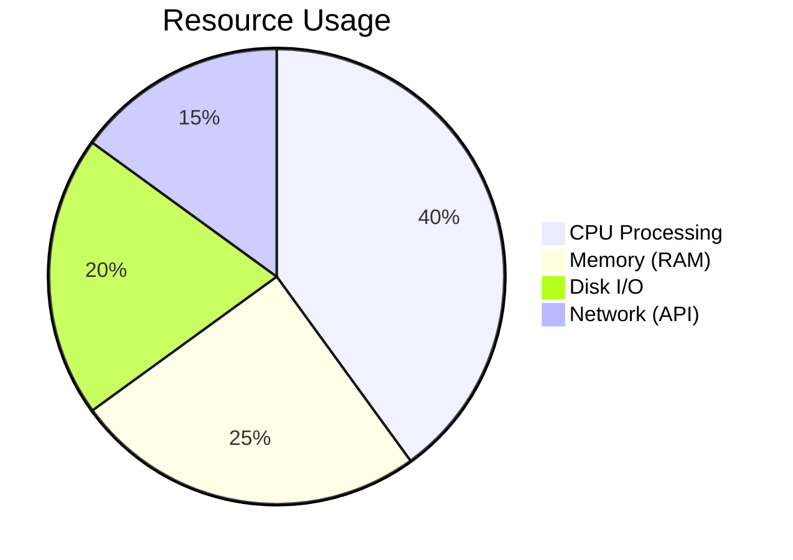

---

## Technology Stack Integration

This diagram shows how all the technologies work together in the OrchestrAIte system.

### Application & Framework Layers
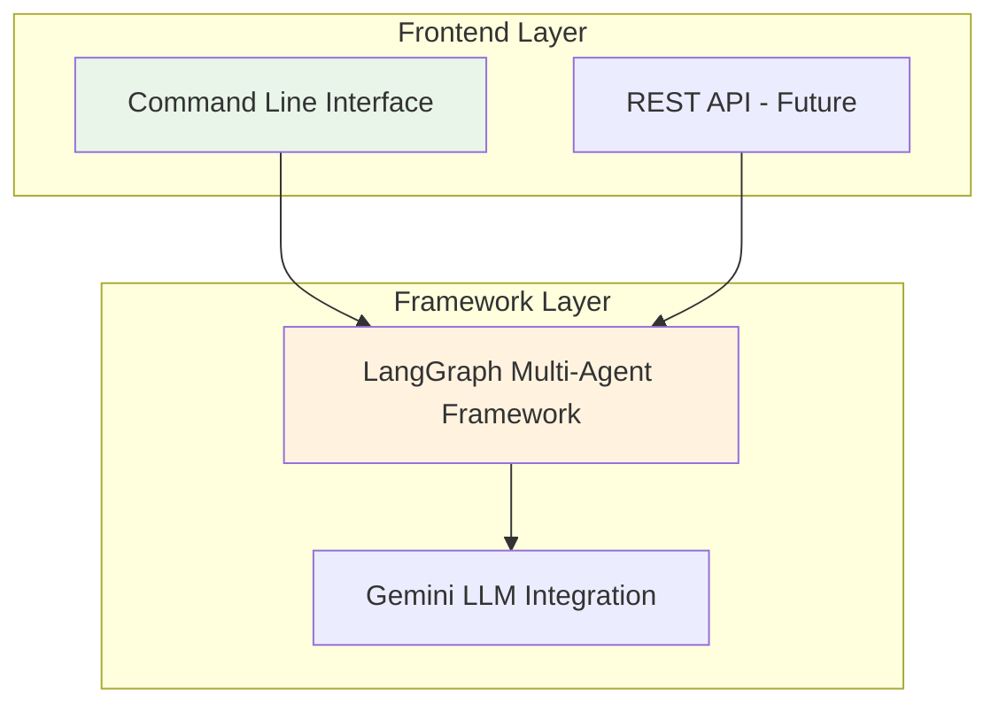

### AI/ML & Music Processing
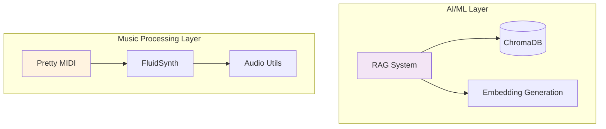

### Storage & File System
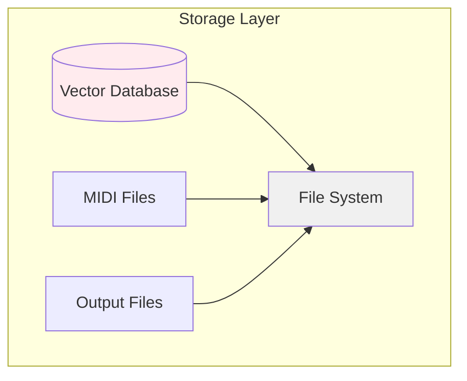

This architecture document provides a comprehensive view of how OrchestrAIte processes musical data and generates new compositions using a sophisticated multi-agent RAG system.
